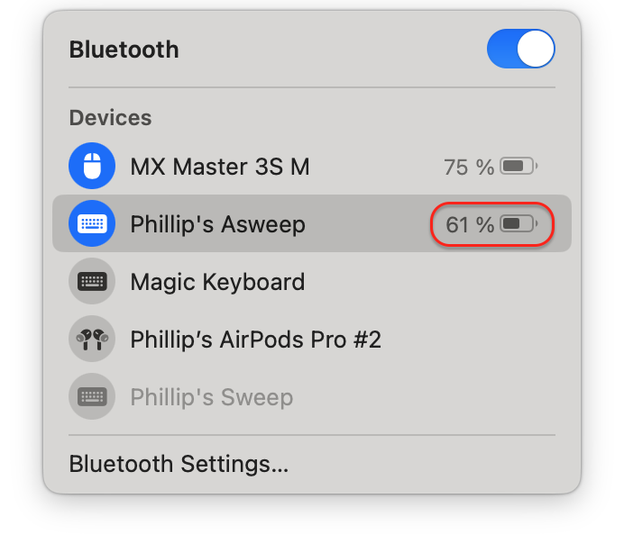
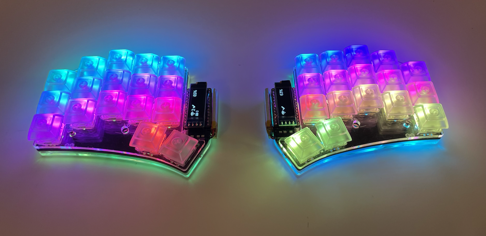
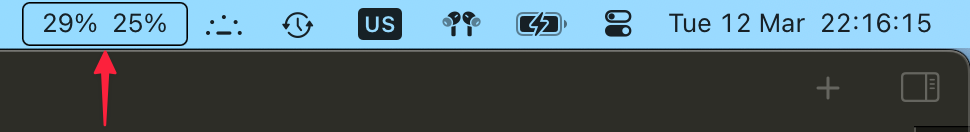
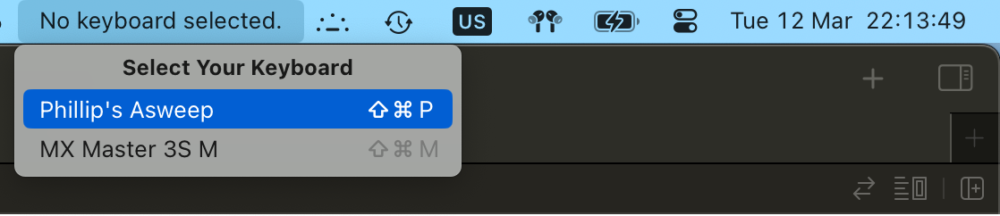

## Mighty Mitts

macOS uses the BLE Battery Service, and specifically the Battery Level characteristic, to display the battery level of BLE accessories like wireless keyboards. 

Some keyboards, however, come in two halves that house individual batteries. 

These keyboards, when running [zmk](https://zmk.dev), can be [configured](https://zmk.dev/docs/config/battery#peripheral-battery-monitoring) to expose _two_ Battery Level characteristics over the Battery Service to convey the battery states of each half. 

However, macOS's native Bluetooth management UI will only display the battery level of the primary half. 

Mighty Mitts is a small app that lives in the menu bar and shows the battery state of each keyboard half. 

MIT license.

